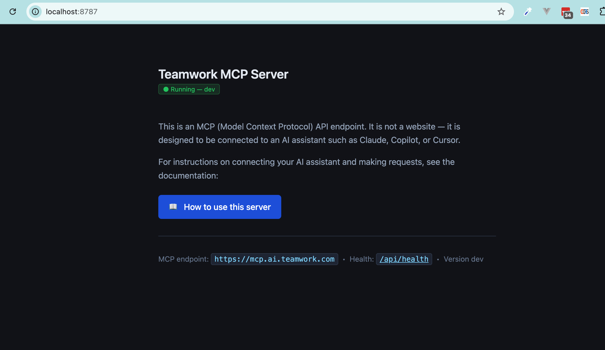
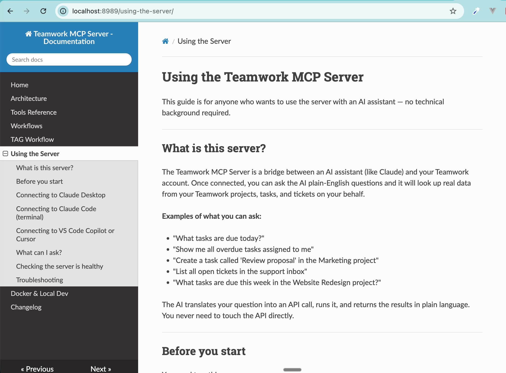

# Docker & Local Development

The project ships a multi-stage `Dockerfile` and a `Makefile` that cover building,
running, and deploying the server without needing Go installed locally.

---

## Prerequisites

- [Docker](https://docs.docker.com/get-docker/) with BuildKit / `docker buildx`
- A Teamwork API token

---

## Docker Compose — `docker compose up -d`

The project includes `local.yml` as its Compose file. TAG's dev environment already has
`export COMPOSE_FILE=local.yml` in `~/.zshrc`, so the standard command just works:

```bash
docker compose up -d
```

This starts **two services**:

| Service | Container | Default port |
|---------|-----------|-------------|
| MCP server | `teamwork-mcp` | `TW_MCP_PORT` (default `8787`) |
| MkDocs docs | `teamwork-mcp-docs` | `TW_MCP_DOCS_PORT` (default `8989`) |



The MkDocs container mounts `./claude/` as a volume, so edits to `claude/docs/*.md` are
reflected live without a rebuild.



To rebuild images after code changes:

```bash
docker compose up -d --build
```

To tail logs:

```bash
docker compose logs -f
```

To stop:

```bash
docker compose down
```

### Environment variables

Copy `.env.example` to `.env` and adjust as needed:

```bash
cp .env.example .env
```

The Compose-relevant variables (with defaults):

| Variable | Default | Description |
|----------|---------|-------------|
| `TW_MCP_PORT` | `8787` | Host port the MCP server is exposed on |
| `TW_MCP_LOG_LEVEL` | `info` | `debug` / `info` / `warn` / `error` |
| `TW_MCP_LOG_FORMAT` | `text` | `text` or `json` |
| `TW_MCP_DOCS_PORT` | `8989` | Host port the MkDocs docs server is exposed on |

### Welcome page

Opening the server URL in a browser (e.g. `http://localhost:8787`) shows a welcome page
confirming the server is running and linking directly to the docs on `TW_MCP_DOCS_PORT`.

### Connecting an MCP client

Once running, point your MCP client at:

```
http://localhost:<TW_MCP_PORT>
```

Pass your Teamwork API token in the `Authorization` header of each MCP request:

```
Authorization: Bearer <your_teamwork_api_token>
```

The MCP server uses that token to authenticate with the Teamwork API on your behalf — no separate server credential needed. The server handles the correct auth method internally (Basic auth for `twp_*` API keys).

---

## Quick Start — compile check

If you just want to verify the Go code compiles (e.g. after making local changes without
Go installed), build only the builder stage:

```bash
docker build --target builder -t mcp-build-check .
```

Any compile errors will surface in the Docker output. A clean exit means the code is good.

---

## Building Images

### HTTP server (default)

```bash
make build
```

Equivalent to:

```bash
docker buildx build \
  --build-arg BUILD_DATE=$(date -u +'%Y-%m-%dT%H:%M:%SZ') \
  --build-arg BUILD_VCS_REF=$(git rev-parse --short HEAD) \
  --build-arg BUILD_VERSION=dev \
  --load \
  --progress=plain \
  --target runner \
  .
```

### STDIO server

```bash
make build-stdio
```

Builds the full image (both binaries are compiled), but the entrypoint is `/bin/tw-mcp-stdio`.

---

## Running Locally

### HTTP server

```bash
docker run --rm \
  -e TW_MCP_BEARER_TOKEN=$TEAMWORK_API_KEY \
  -p 8787:8080 \
  mcp-build-check
```

The server listens on `:8787`. MCP clients connect with:

```
Authorization: Bearer TEAMWORK_API_KEY
```

### STDIO server

```bash
docker run --rm -i \
  -e TW_MCP_BEARER_TOKEN=$TEAMWORK_API_KEY \
  --entrypoint /bin/tw-mcp-stdio \
  mcp-build-check
```

Pass the `-read-only` flag to disable all write tools:

```bash
docker run --rm -i \
  -e TW_MCP_BEARER_TOKEN=$TEAMWORK_API_KEY \
  --entrypoint /bin/tw-mcp-stdio \
  mcp-build-check -read-only
```

---

## Dockerfile Structure

The `Dockerfile` uses three stages:

| Stage | Base image | Purpose |
|-------|-----------|---------|
| `builder` | `golang:1.26-alpine` | Downloads deps, compiles both binaries |
| `runner` | `alpine:3` | Minimal runtime image, HTTP entrypoint |
| `stdio` | `runner` | Same image, STDIO entrypoint |

Both binaries (`tw-mcp-http`, `tw-mcp-stdio`) are compiled in the builder stage and copied
into the runner. The final image contains no Go toolchain.

---

## Environment Variables

| Variable | Purpose | Default |
|----------|---------|---------|
| `TW_MCP_BEARER_TOKEN` | Teamwork API key (STDIO mode) or token clients must supply (HTTP mode) | — |
| `TW_MCP_SERVER_ADDRESS` | HTTP bind address | `:8080` |
| `TW_MCP_LOG_LEVEL` | `debug` / `info` / `warn` / `error` | `info` |
| `TW_MCP_LOG_FORMAT` | `text` / `json` | `text` |
| `TW_MCP_VERSION` | Version string (set at build via `BUILD_VERSION` arg) | — |

---

## Pushing to Registries

### Public (GitHub Container Registry)

```bash
make push-stdio
```

Tags: `ghcr.io/teamwork/mcp:vX.Y.Z` and `ghcr.io/teamwork/mcp:latest`.

### Internal (AWS ECR)

```bash
make push
```

Tags against the internal ECR registry using the current branch name.

---

## Tips

**Iterating without rebuilding the whole image** — use a bind mount against the builder stage
during development:

```bash
docker run --rm \
  -v $(pwd):/usr/src/mcp \
  -w /usr/src/mcp \
  golang:1.26-alpine \
  go build ./...
```

This gives you a fast compile loop using the same Go version as the Dockerfile, without
installing Go on your host machine.

**Watching logs in JSON mode:**

```bash
docker run --rm \
  -e TW_MCP_BEARER_TOKEN=$TEAMWORK_API_KEY \
  -e TW_MCP_LOG_FORMAT=json \
  -p 8787:8080 \
  mcp-build-check | jq .
```
