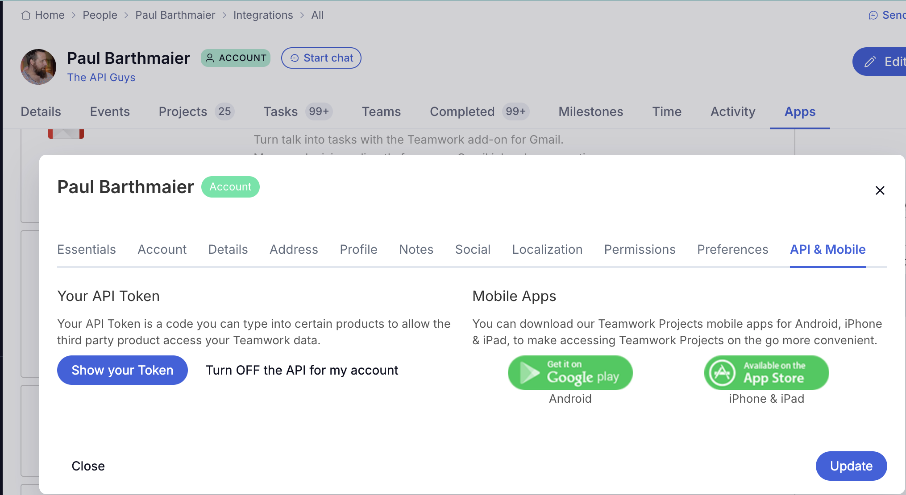

# Teamwork MCP Server

The official [Model Context Protocol](https://modelcontextprotocol.io/) server for [Teamwork.com](https://teamwork.com). Exposes Teamwork Projects and Teamwork Desk operations as MCP tools for AI assistants (Claude, Copilot, Gemini, etc.).

| | Repo | Go module |
|---|---|---|
| **Our fork** | [TheAPIGuysDev/teamwork-mcp](https://github.com/TheAPIGuysDev/teamwork-mcp) | `github.com/TheAPIGuysDev/teamwork-mcp` |
| **Upstream** | [teamwork/mcp](https://github.com/teamwork/mcp) | `github.com/teamwork/mcp` |

## Quick Start

**Step 1 — Get your Teamwork API token** from your Teamwork account under *Your Profile → API Keys*. It looks like `twp_xxxxxxxxxxxx`.



**Step 2 — Create your `.env` file.** Copy the example and open it in a text editor:

```bash
cp .env.example .env
```

Add your API token to the file:

```
TEAMWORK_API_KEY=twp_xxxxxxxxxxxx
TEAMWORK_WORKSPACE_URL=yourcompany.teamwork.com
```

**Step 3 — Start the server:**

```bash
docker compose up -d
```

This starts two services:

| Service | Default port | URL |
|---------|-------------|-----|
| MCP server | `TW_MCP_PORT` (default `8787`) | `http://localhost:8787` |
| MkDocs docs | `TW_MCP_DOCS_PORT` (default `8989`) | `http://localhost:8989` |

Visit `http://localhost:8787` in your browser — you should see the server welcome page. Then see [Using the Server](using-the-server.md) to connect your AI assistant.

> **Note:** `docker compose` uses `local.yml` by default — `COMPOSE_FILE=local.yml` is set in `~/.zshrc`. No Go installation required.

### Other run modes

```bash
# STDIO mode (local desktop integration)
TW_MCP_BEARER_TOKEN=$TEAMWORK_API_KEY go run cmd/mcp-stdio/main.go

# HTTP mode without Docker
go run cmd/mcp-http/main.go   # binds :8080 by default
```

See [Docker & Local Dev](docker.md) for full Docker and Compose reference, and [Workflows](workflows.md) for Node/LangChain and Python/LangChain usage.

## When to use LangChain

The MCP server is a protocol endpoint — any MCP-compatible client (Claude Desktop, VS Code Copilot, Cursor, etc.) can connect to it directly with zero extra code. That covers the vast majority of use cases.

LangChain comes in when you're **building your own application** that needs to orchestrate an LLM + tools programmatically:

- Writing a script or app that automatically queries Teamwork and acts on the results — no human in the loop
- Choosing your own LLM (OpenAI, Anthropic, Gemini) and wiring it to the MCP tools yourself
- Needing custom logic around the agent loop — retries, multi-step pipelines, structured output parsing
- Embedding MCP into a larger system — a Slack bot, a CI job, a scheduled report

The examples in `examples/nodejs-langchain/` and `examples/python-langchain/` are templates for building something custom, not end-user tools.

**TL;DR:** Connect via Claude Desktop / VS Code for interactive use. Use LangChain when you're writing code that automates Teamwork workflows with an LLM.

## Current Status

- Three transport implementations: HTTP, STDIO, HTTP-CLI
- Full Teamwork Projects toolset (~10k lines across 20+ domain files)
- Full Teamwork Desk toolset (tickets, messages, inboxes, tags, statuses)
- DataDog APM + Sentry error tracking integrated in HTTP server
- Read-only mode supported in STDIO server

## Key Decisions

- **No single binary**: Three separate `cmd/` entrypoints — HTTP and STDIO have meaningfully different middleware stacks and startup logic.
- **`init()` registration**: Each domain file registers its tools in `init()`. Adding an import is enough to activate a toolset.
- **Read-only enforcement**: Done at the `ToolsetGroup` level, not per-handler. Write tools are simply not registered when read-only mode is active.
- **API key for STDIO**: The HTTP server supports OAuth2; STDIO uses a single static Teamwork API key from `TW_MCP_BEARER_TOKEN`. `twp_*` API keys use Basic auth internally; the env var name is kept for historical reasons.
